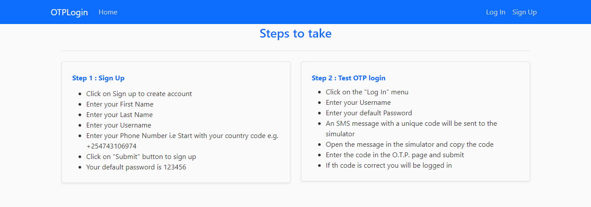

# O.T.P-LoginSystem
The repository contains an implementation of a One Time Password Login system developed using Africa's Talking Short Codes API. Once a user logins in, they are prompted to enter an OTP that is sent to their Phone. Such a system enhances a system's user authenticity metric thereby preventing cases of bruteforce login. < br />

